# Logistics Tracking using Blockchain

We're a shipping company, providing global tracking services for our customers using blockchain.

We have 3 different users to interact with this dapp.

* Admins
    The admin has control of the contract, and will be able to whitelist courier and user address, while also being able to log and track shipping information
* Courier
    The courier has the ability to log shipping information using ipfs onto the blockchain
* Users
    The user will be able track the item only.

Each user group will have a certain limitation on the functionality available to them, to ensure privacy of information.
# Front End Webpage
The landing page requires the user to be logged into metamask to interact with the smart contract.

If the account is not recognized by the smart contract, it will give an error
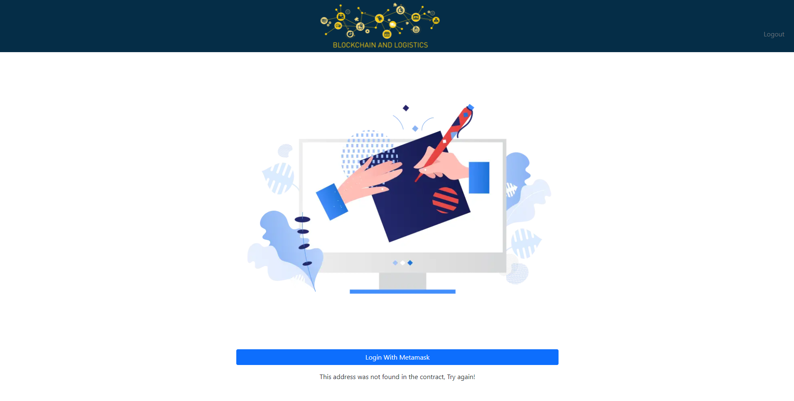

## Admin Functionality
The admin has full functionality and is able to perform the following actions.

### Add Couriers
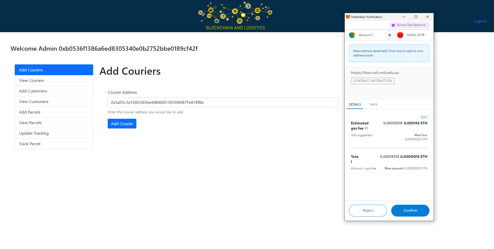

### View Couriers
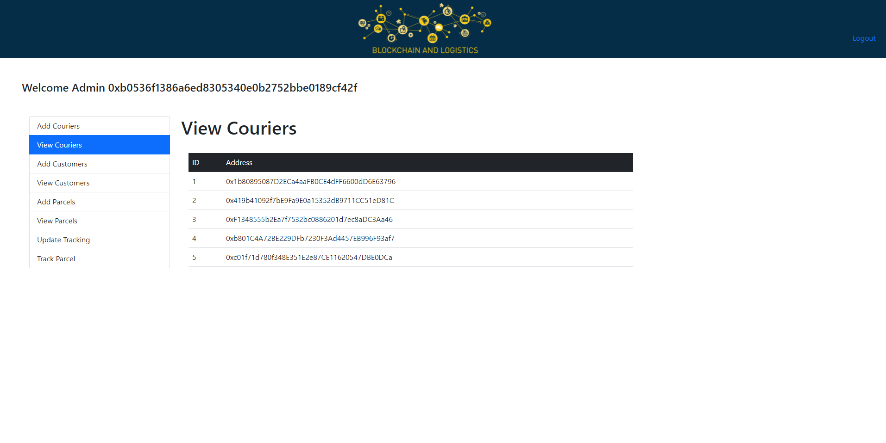

### Add Customers
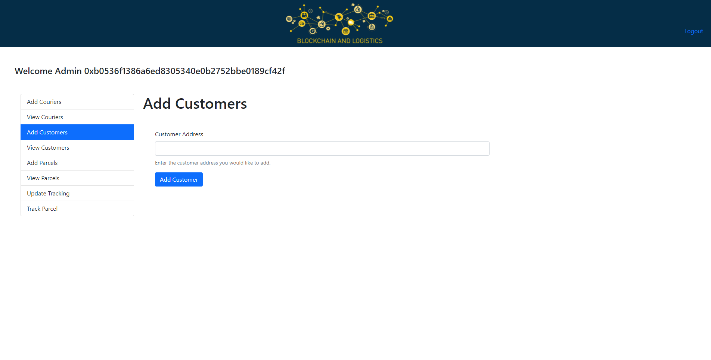

### View Customers
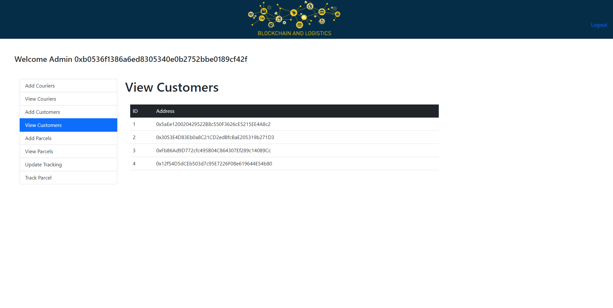

### Add Parcels
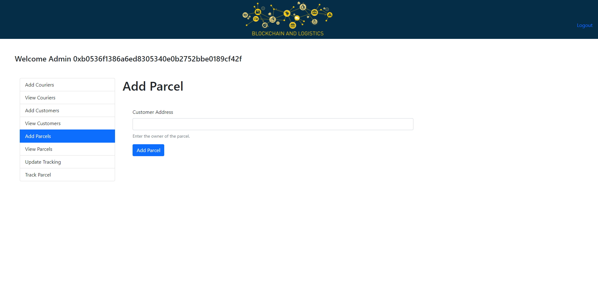

### View Parcels
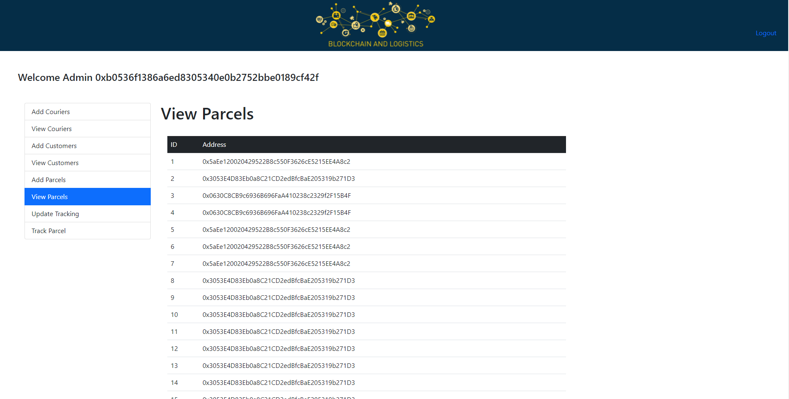

### Update Tracking
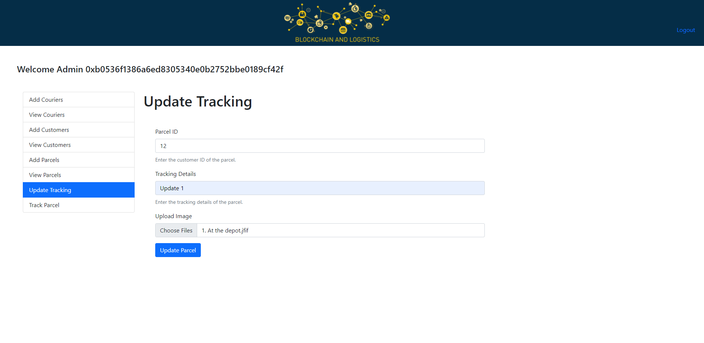

### Track Parcel
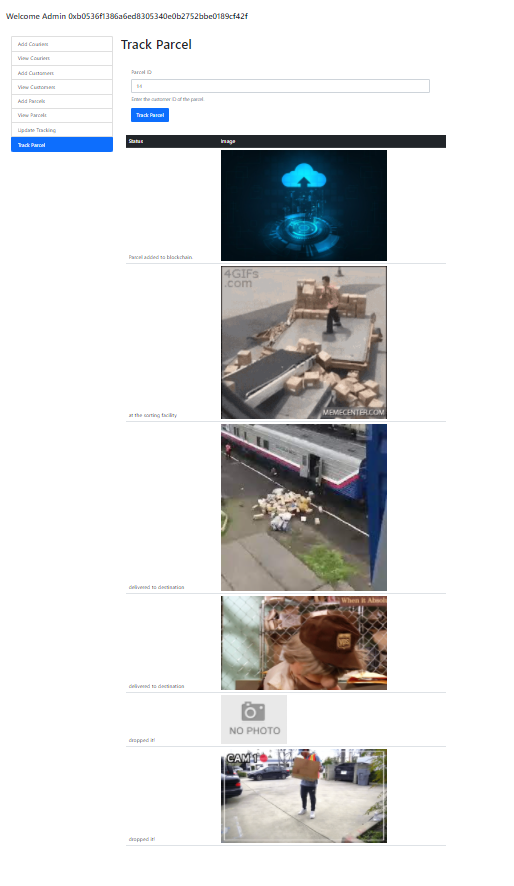

## Courier Functionality
The courier functions are similar to the admin, but they cannot add or view couriers or add customer.

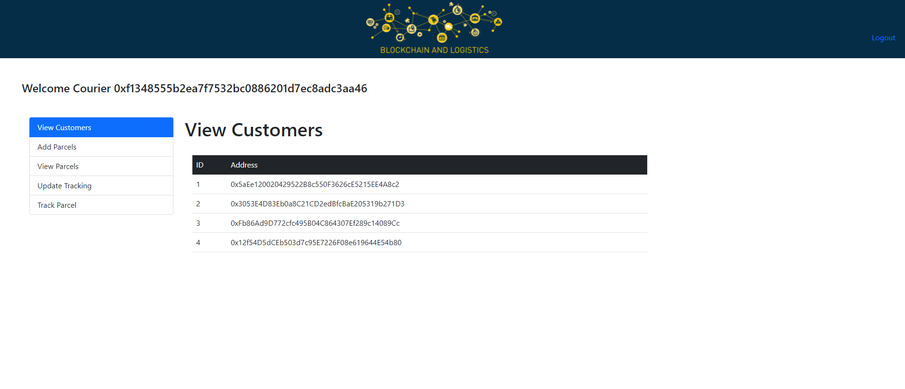

## Customer Functionality
The customer can only view and track their own parcels.

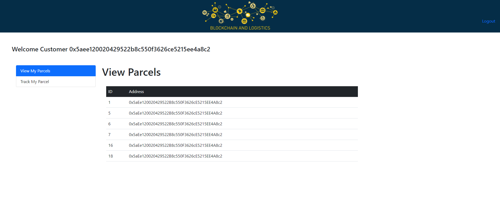
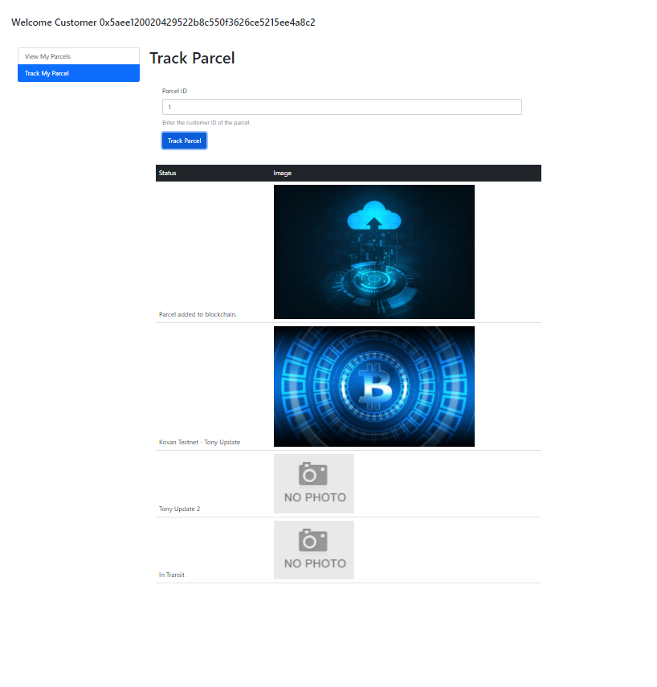
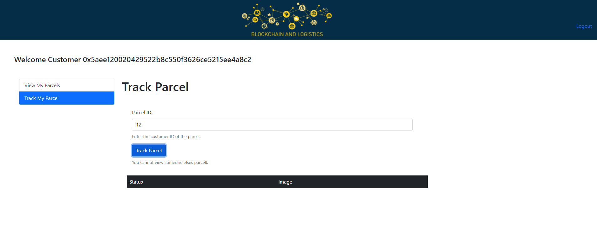